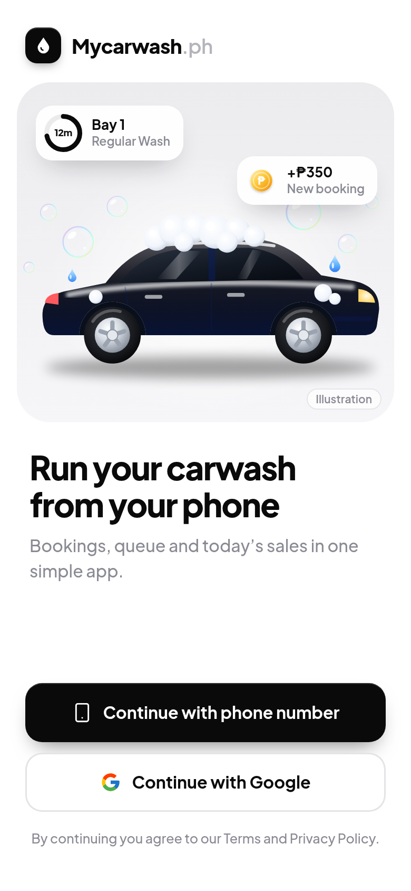
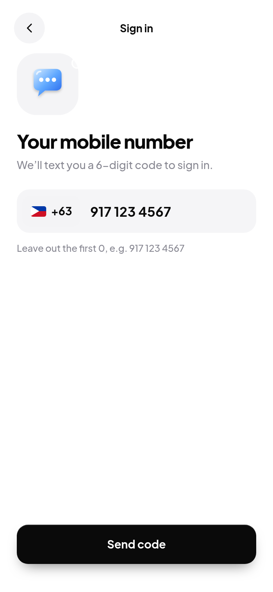
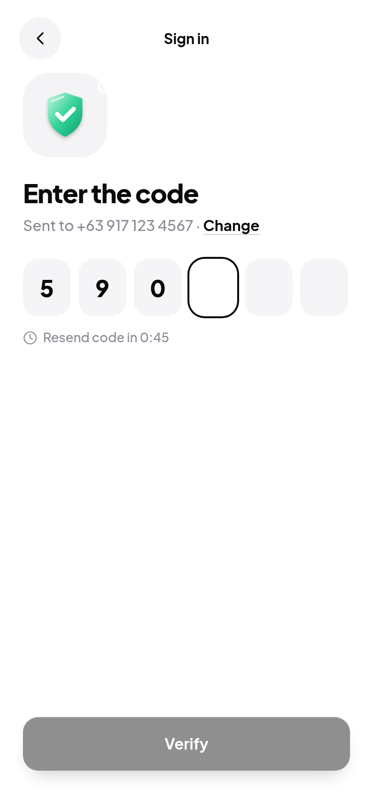
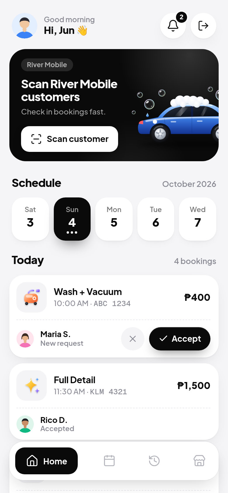
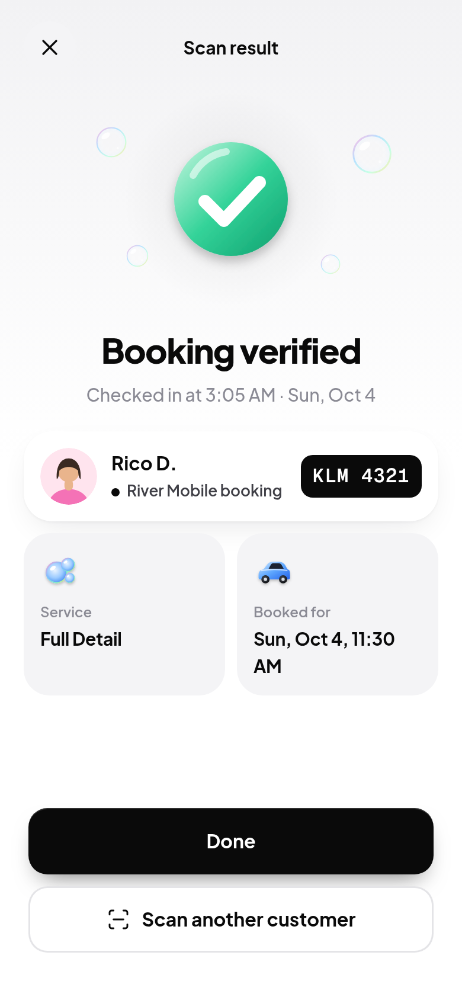
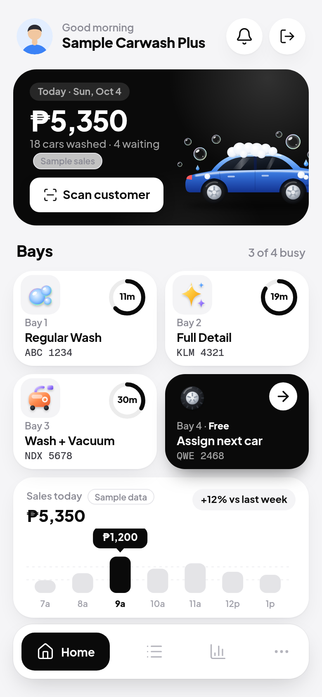
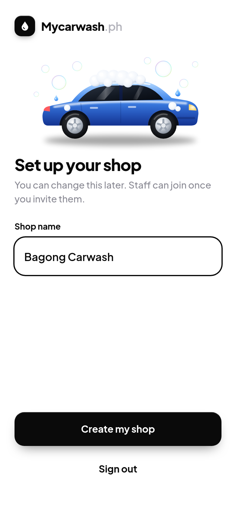
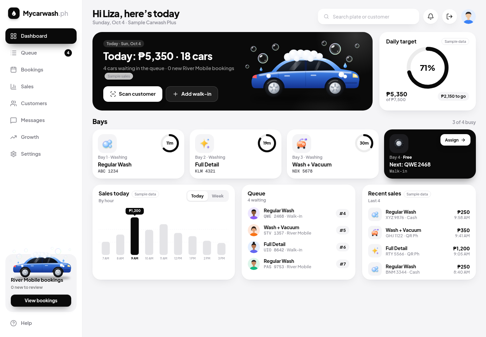

# Mycarwash.ph

Car wash management web app by **River Apps** for shop owners and staff.
Web only: desktop and phone browsers, designed mobile-first.

- **Partner** shops get a light app: receive River Mobile bookings, accept or
  decline, **Scan** to verify customers on arrival, and booking history.
- **Paid** shops get the full system: everything in Partner plus bays, queue,
  customers and (later) sales, messaging and growth tools. Partner pricing is **₱950/month** or **₱10,000 one-time** (Billing in Settings). Paid plan prices are not
  set yet and are not in the code.

> **Standalone.** Mycarwash.ph has its own Firebase project, its own databases
> and its own sign-in. It shares no database, users or code at runtime with
> River Mobile or any other River Apps product. River Mobile connects **only
> through the versioned public API** (`/v1`, see [docs/api.md](docs/api.md)).

Status: **Phase 1** (+ location/Maps, Partner billing UI, responsive dashboards) — live sales on Paid home, queue/walk-in/pay UI, team invites,
Messages alerts, Growth metrics, `/v1` App Hosting proxy. Partner home still uses
real bookings; Paid sales/target are live (no Sample data badges on those widgets).

### Guest browse (River Mobile–style)

You can **Browse dashboard as guest** from the welcome screen without signing in.
Shop pages show **local sample/preview data only** (never another shop’s Firestore).
Actions that mutate (accept booking, scan, walk-in, save Settings, billing, etc.)
open a **Sign up or log in** sheet (same idea as River Mobile `AuthGateSheet` /
`useAuthGate` + `enterAsGuest`). After login you return to the page you were on.


## Screens

| | | | |
|---|---|---|---|
|  |  |  |  |
|  |  |  | |



All screenshots were captured from the real app running against the Firebase
emulators (`scripts/screenshots.py`), signed in with phone + SMS code.

## Architecture

```
mycarwashph/
├─ frontend/            Next.js 16 App Router + React 19 + TypeScript + Tailwind 4 (shop web app)
├─ backend/functions/   Express API on Firebase Cloud Functions v2 (Node 22, asia-southeast1)
├─ packages/            River Apps UI Kit, vendored (tokens, icons, ui) — see packages/VENDORED.md
├─ tests/rules/         Firestore security rules tests (emulator)
├─ firestore.rules      Member-only reads, server-only writes
├─ firebase.json        Functions, Firestore (both databases), Auth, App Hosting, emulators
├─ .firebaserc          Firebase project `mycarwashph`
├─ apphosting*.yaml     App Hosting config: shared + dev / prod overrides
└─ docs/                api.md, screenshots/
```

```
Phone / desktop browser ──► frontend (Next.js on App Hosting) ──Firebase ID token──► mycarwashApi<Env> ──► Firestore DB
                               │                                                         ▲
                               └── Firebase Auth (phone SMS code, Google)                │
River Mobile backend ──API key (placeholder)──► mycarwashPublicApi<Env> (/v1) ───────────┘
```

**Backend** (`backend/functions/src`), following River Kit's structure:

- `config/brand.ts` (names, URLs), `config/env.ts` (env config)
- `middleware/`: `auth-middleware.ts` (verifies Firebase ID tokens),
  `business-middleware.ts` (**`requireMembership`**, `requireRole`, `requirePlan`),
  `validate.ts` (Zod), `http-middleware.ts` (CORS, rate limit),
  `error-middleware.ts` (RFC 7807 problem+json), `api-key-middleware.ts` (`/v1`)
- `routes/` → `services/` → `store/` (a small document-store port with a Firestore
  implementation and an in-memory one for unit tests)
- Audit logs on every mutation (`businesses/{id}/audit_logs`), dual GET endpoints

**Tenancy (the River Kit gap, fixed).** Every route under
`/businesses/:businessId` first loads `businesses/{businessId}/members/{uid}` and
rejects the request unless that membership exists, is active, belongs to that
business and has an allowed role (`owner` or `staff`). Unknown businesses and
other people's businesses both return `403`. Nothing is auto-created on read.
Firestore rules mirror this for direct reads, and all writes go through the API.

**Data model** (Firestore, `businesses/{businessId}` with subcollections):
`members`, `services`, `bays`, `customers`, `bookings`, `queue`, `audit_logs`,
`counters`. The business has `plan: "partner" | "paid"`. Money is integer
centavos; queue numbers reset on the Manila calendar day. Platform collections:
`api_clients`, `api_booking_index`, `api_idempotency`. Types live in
`backend/functions/src/models/types.ts`.

**Auth.** Passwordless only: Firebase **phone sign-in** (+63, SMS code with an
invisible reCAPTCHA) and **Google** (popup on desktop, redirect on phones).
Shops are created by their owner; staff invites are Phase 1.

## Setup

Requirements: Node 22, pnpm 10 (`corepack enable`), Java 21+ (for the Firestore
and Auth emulators), Python 3 + Playwright only if you want to regenerate
screenshots.

```bash
pnpm install
pnpm build:packages      # builds the vendored UI kit (tokens, icons, ui)
```

### Run locally against the emulators (no Firebase project needed)

The emulators use the offline demo project `demo-mycarwash` (with the same
named database `mycarwash-dev` the dev functions use), so nothing touches the
real `mycarwashph` project and no real SMS is sent.

```bash
# terminal 1: Auth, Firestore and Functions emulators (UI at http://127.0.0.1:4000)
pnpm emulators

# terminal 2: SAMPLE data (two shops, bays, queue, bookings made through /v1)
pnpm seed:emulator

# terminal 3: the web app at http://localhost:3000
pnpm dev
```

Sign in with **+63 917 123 4567** (Partner shop) or **+63 918 123 4567** (Paid
shop). The SMS code appears in the emulator UI (Authentication tab) and in the
emulator logs; you can also read it from
`http://127.0.0.1:9099/emulator/v1/projects/demo-mycarwash/verificationCodes`.
Any other number signs up fresh and goes to "Set up your shop". The seed prints a
check-in QR payload you can paste on the Scan screen. Google sign-in works with
the emulator's fake account picker.

Regenerate screenshots (emulators seeded and app running on :3000):

```bash
CHROME_PATH=/usr/bin/google-chrome python3 scripts/screenshots.py
```

### Checks

```bash
pnpm lint
pnpm typecheck
pnpm test          # Vitest: API membership/role/plan checks, Scan, /v1, lifecycle
pnpm test:rules    # Firestore rules tests (starts the Firestore emulator)
pnpm build         # UI kit, functions, web app
```

CI (`.github/workflows/ci.yml`) runs install, lint, typecheck, unit tests and
build, plus the rules tests on the emulator.

## Environment variables

Only `.env.example` files are committed. Never commit real values.

**`frontend/.env.example`** → copy to `frontend/.env.local`

| Variable | Purpose |
|---|---|
| `NEXT_PUBLIC_FIREBASE_API_KEY`, `_AUTH_DOMAIN`, `_PROJECT_ID`, `_APP_ID` | Web config of the "Mycarwash PH Web" app in `mycarwashph`. On App Hosting derived from `FIREBASE_WEBAPP_CONFIG`; locally optional (defaults target the emulator demo project) |
| `NEXT_PUBLIC_GOOGLE_MAPS_API_KEY` | Optional. Google Maps JS + Places for shop address pin (Philippines). Without it, Settings/onboarding still accept address + manual lat/lng |
| `NEXT_PUBLIC_USE_EMULATORS` | `true` to use the local Auth emulator (default `true`) |
| `NEXT_PUBLIC_AUTH_EMULATOR_URL` | Auth emulator URL (default `http://127.0.0.1:9099`) |
| `NEXT_PUBLIC_APP_ENV` | `local`, `dev` or `prod` (label) |
| `NEXT_PUBLIC_API_BASE_URL` | Base URL of the shop API for the environment (`mycarwashApiDev` / `mycarwashApiProd`) |

**`backend/functions/.env.example`** → `backend/functions/.env.local` (emulator only)

| Variable | Purpose |
|---|---|
| `ALLOWED_ORIGINS` | Optional CORS override; defaults per environment are in `src/config/environments.ts` |
| `API_KEY_PEPPER` | Emulator only. Deployed functions read `API_KEY_PEPPER_DEV` / `API_KEY_PEPPER_PROD` from Secret Manager |

## Firebase project and environments

One Firebase project, **`mycarwashph`** ("Mycarwash PH", Blaze). Dev and prod
share the project, Firebase Auth and the Functions deployment; they differ by
**Firestore named database**, **function names** and **App Hosting backend**:

| | dev | prod |
|---|---|---|
| Firestore database (asia-southeast1) | `mycarwash-dev` | `mycarwash-prod` |
| Shop API function | `mycarwashApiDev` | `mycarwashApiProd` |
| River Mobile API function (`/v1`) | `mycarwashPublicApiDev` | `mycarwashPublicApiProd` |
| API key pepper (Secret Manager) | `API_KEY_PEPPER_DEV` | `API_KEY_PEPPER_PROD` |
| App Hosting backend | `mycarwash-dev` | `mycarwash-prod` |
| App Hosting environment / overrides | `dev` / `frontend/apphosting.dev.yaml` | `prod` / `frontend/apphosting.prod.yaml` |
| Web URL | https://mycarwash-dev--mycarwashph.asia-southeast1.hosted.app | https://mycarwash-prod--mycarwashph.asia-southeast1.hosted.app |

The mapping lives in `backend/functions/src/config/environments.ts`; each
function binds its database with `getFirestore(app, databaseId)`. There is no
`(default)` database. Note: Auth users are shared by both environments (one
project), so a person who signs in on dev also exists on prod, but their shops
and memberships live in separate databases.

The web app does not read Firestore directly. The browser calls same-origin
`/api/*`; the App Hosting Next.js server forwards those to the private shop API
Cloud Run service (Google ID token from the backend service account + the user's
Firebase ID token). That keeps the functions private under the organisation's
Domain restricted sharing policy. The partner API (`/v1`) stays private until
River Mobile integration. The Firebase web config is injected by App Hosting
(`FIREBASE_WEBAPP_CONFIG`, mapped in `frontend/next.config.ts`); nothing is committed.

Deploy (from the repo root, logged in to the Firebase CLI with access to `mycarwashph`):

```bash
firebase deploy --only firestore --project mycarwashph            # rules + indexes to both databases
firebase deploy --only functions --project mycarwashph            # all four functions
firebase deploy --only apphosting:mycarwash-dev --project mycarwashph   # web app, dev (from local source)
firebase deploy --only apphosting:mycarwash-prod --project mycarwashph  # web app, prod
firebase deploy --only auth --project mycarwashph                 # Google sign-in provider
```

Secrets: `firebase functions:secrets:set API_KEY_PEPPER_DEV` (and `_PROD`).

Phone SMS on hosted App Hosting builds always uses real reCAPTCHA (never
`appVerificationDisabledForTesting`). That flag is set only when talking to the
Auth emulator locally. Firebase Auth test phone numbers remain configured for
manual console testing if needed; real numbers go through SMS on Blaze.


App Hosting builds the monorepo through its Turborepo support: both backends use
root directory `frontend` (see `firebase.json`), the CLI uploads the whole repo,
and the buildpack runs `turbo run build --filter=@mycarwash/web` (UI kit packages
first, per `turbo.json`), then the App Hosting Next.js adapter (standalone output).

## Licence

Proprietary to River Apps; see [LICENSE](LICENSE). Public visibility does not
grant a licence. The vendored UI kit is covered by `packages/LICENSE`.
